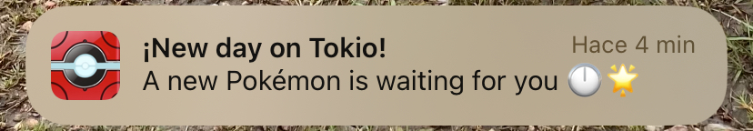

# 🔥 Pokédex en SwiftUI 🔥

Desarrollé una Pokédex utilizando SwiftUI y la arquitectura MVVM, consumiendo los datos de PokéAPI. Con este proyecto, profundicé en el consumo de APIs, el diseño de interfaces declarativas y la organización del código en una app escalable.

📌 Características principales:

✅ Pokédex: La pantalla principal muestra un listado con buscador, permitiendo explorar todos los Pokémon disponibles en la API y acceder a su vista detallada.

✅ My Daily Pokémon: Una tarjeta especial muestra un Pokémon aleatorio que se genera cada día a las 00:00 hs de Japón. Además, la app envía una notificación para que no te pierdas la llegada de tu nuevo Pokémon diario.

✅ Espacio para entrenadores: La app permite almacenar hasta 6 Pokémon diarios en la memoria del teléfono, con la posibilidad de intercambiarlos a elección del usuario.

